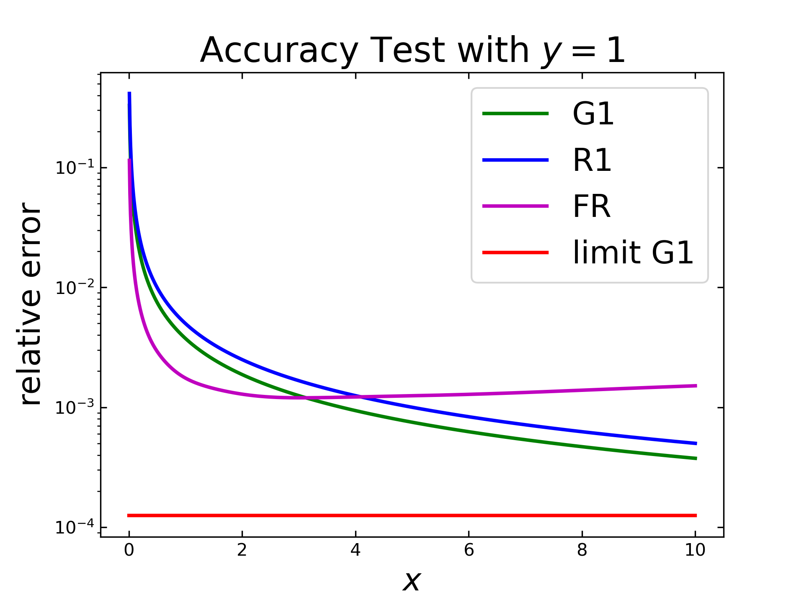
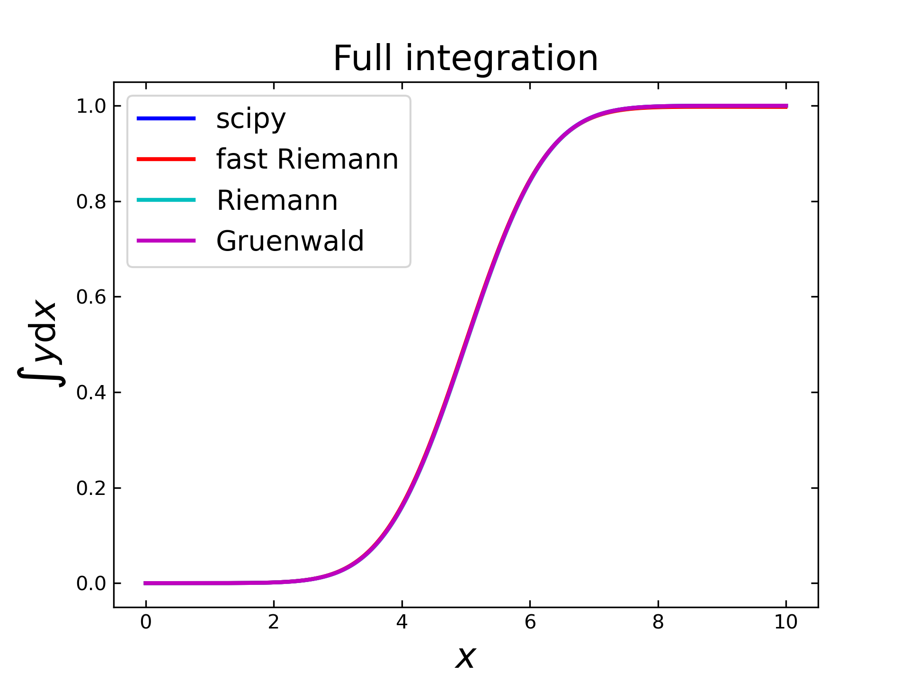
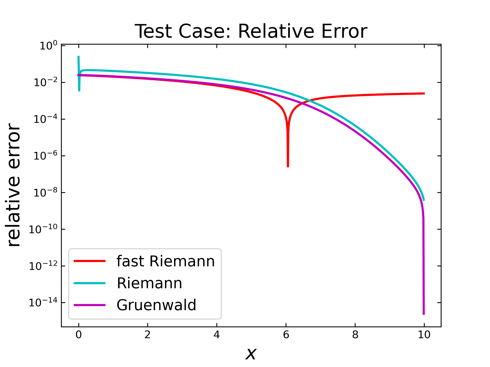
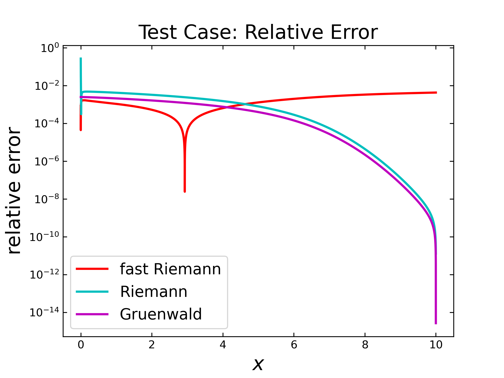
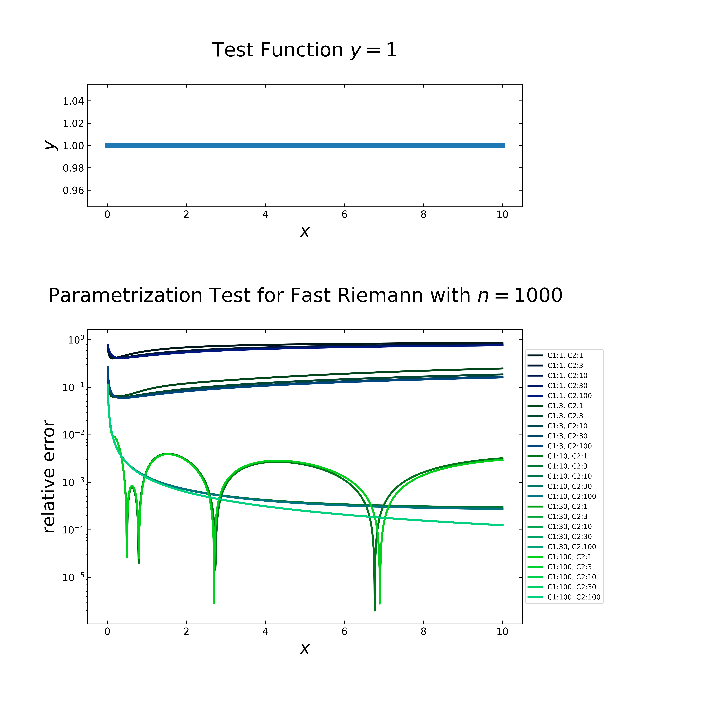
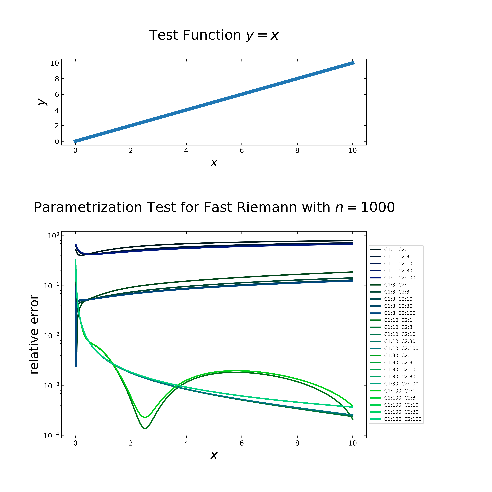
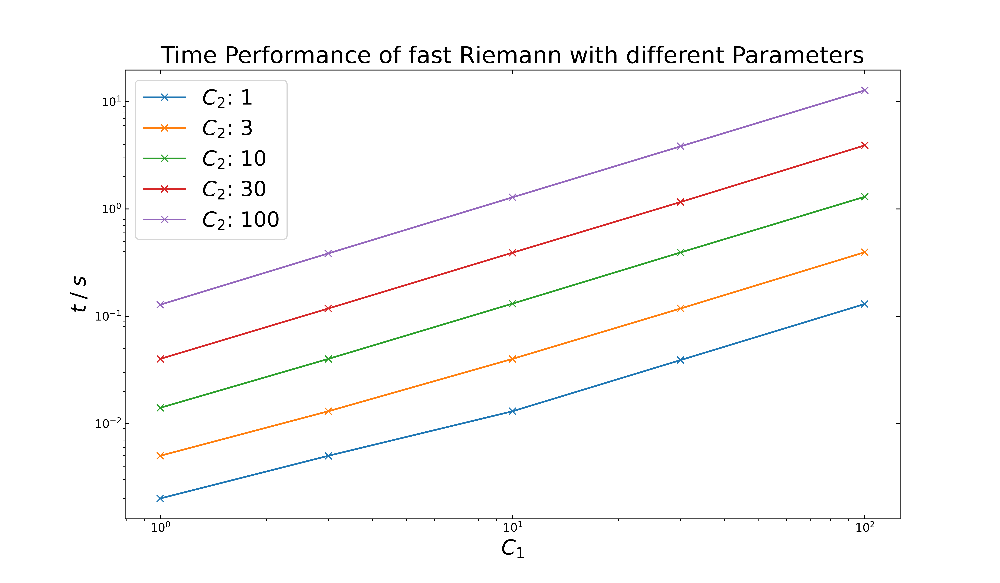
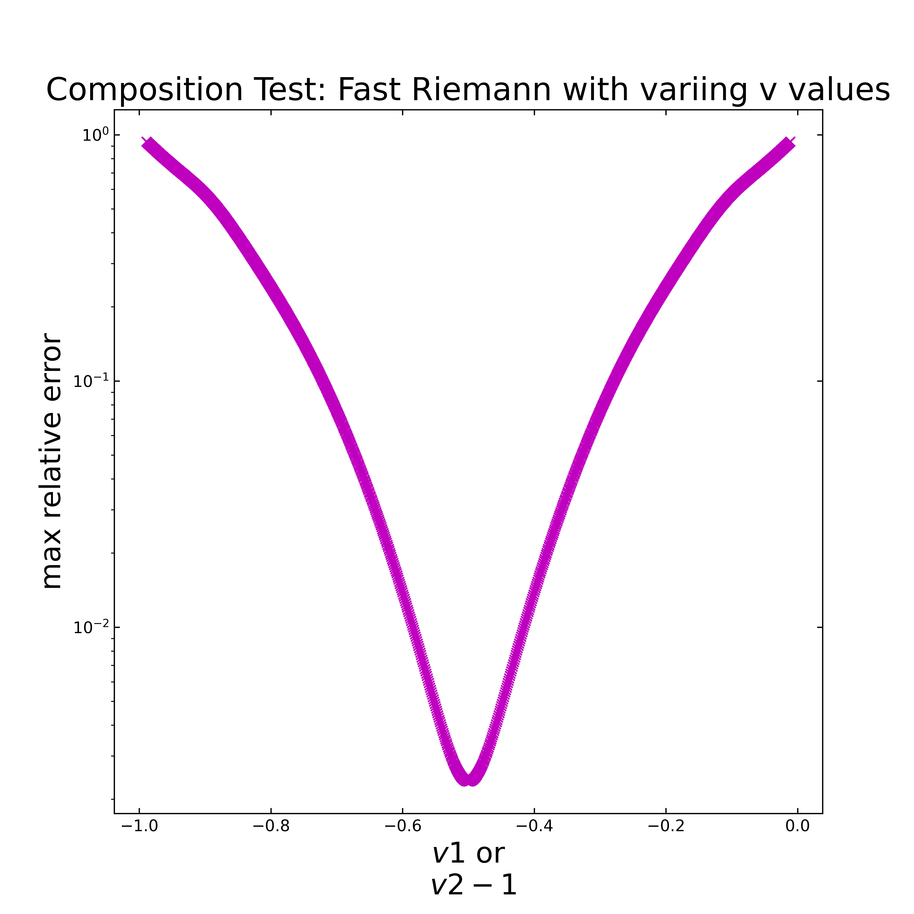
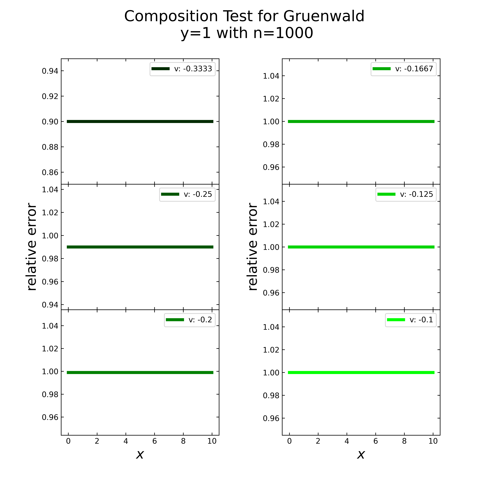
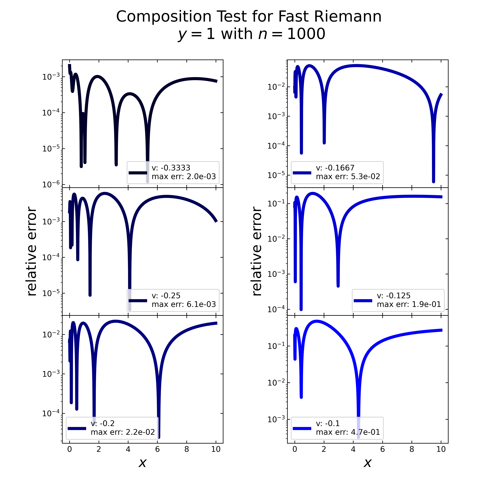

Semi Integration and Differentiation
====================

Part of the ec-tools package are the implemented semi integration (or differentiation) algorithms. The following chapter describes the underlying principles and algorithms, based on Oldham literature in [1, 5] and Pajkossy in [2]. The second chapter gives information about how to call the implemented algorithms. In the third chapter, these algorithms are tested for accuracy, functionality and (time) performance. At the very end, the used references are listed.

Fundamentals
------------------------------------

```{eval-rst}
.. automodule:: ec_tools.semi_integration
```

Call Algorithms
------------------------------------
```{eval-rst}
.. automodule:: ec_tools.semi_integration.semi_integration
   :members:
```
The generalized ``semi_integration`` function can be imported and executed by:  

```sh
from ec_tools.semi_integration import semi_integration
semi_integration(I, t, alg, transonic_backend)
```

Here, the implemented algorithms can be selected by the alg flag (see above) or 
the algorithms can be imported and executed individually (listed below).
Since the semi-integration can be more or less computationally intensive the possibility to speed up the computation by relying on the nice `transonic` library has been build in.


```{eval-rst}
.. automodule:: ec_tools.semi_integration.gruenwald 
   :members:
```

Import the Gruenwald function directly by:

```sh
from ec_tools.semi_integration import gruenwald
res = gruenwald(I, delta_t, v)

```


```{eval-rst}
.. automodule:: ec_tools.semi_integration.riemann
   :members:
```

Import the Riemann function directly by:
```sh
from ec_tools.semi_integration import riemann
res = riemann(I, delta_t, v)

```


```{eval-rst}
.. automodule:: ec_tools.semi_integration.fast_riemann
   :members:
```
Import the Fast Riemann function directly by:
```sh
from ec_tools.semi_integration import fast_riemann
res = fast_riemann(I, delta_t, v)

```

## Testing

In this chapter the semi-algorithms are tested on simple and more applied functions in order to see their accuracy, their general functionality and their performance regarding time and deviations (absolute and relative errors). 
### Accuracy Test

In order to evaluate the general quality of the semi-integration algorithms,
let's consider first some simple functions, i.e. f = C (any constant), f = x and f = x^2.
From the literature [5] of Olham, a table in chapter 7.3 (p. 118f) displays 
the resulting semi-differentiation (v=0.5) and semi-integration (v=-0.5) of different functions.
The following table shows them for the chosen cases.

 

Furthermore, Oldham provides in his book [5] in chapter 8.2 a table (8.2.1), which gives an insight of the relative errors for different semi-integration algorithms. The next table provides these expected relative errors for our implemented algorithms (G1: Gruenwald; R1: Riemann). There, ζ( ) is the Riemann zeta function by Abramowitz & Stegun, (1964, p. 807) which is already implemented in scipy.special.zeta. For Riemann, the relative error applies only for semi-integration (i.e. q<0).

 


**Test 1: f=1 (constant)**

In the first test, the accuracy (relative error) of the implemented algorithms are tested on a constant function (f=1) with 1000 steps. 
The following figure shows the relative error (semi logarithmically) along an x-range. Here shows the Gruenwald algorithm (green) a decreasing behavior. The red line displays the limit, which was mentioned by Oldham (see above table) and indeed, if the number of steps would be increased, the algorithm comes closer to that boundary. For the Riemann algorithm (blue) is the possible limitation along to zero, which implies its accuracy could be theoretically increased, depending on the number of steps. The purple graph displays the result with the fast Riemann, which seems to increase slightly after a step decrease.

 

**Test 2: f=x**

The next test covers the application on f=x with 1000 steps, where the next figure displays the relative error (semi logarithmically) along the x values. The Riemann algorithm (blue) is in this case already limited by the machine precision, therefore it 'jumps' along 1e-15. The Gruenwald algorithm seems to have a lower accuracy and reach already the mentioned limitation from the table above, i.e. to improve the accuracy, the number of steps must be increased. The fast Riemann (purple) shows a strange acting. At first the relative error decrease normally, then drops sharply and then increase again, like an inverted peak. This behavior will be discussed later, as the c parameter of that algorithm plays an important role to the accuracy and the time performance.

 

**Test 3: f=x^2**

The last test with f=x^2 and 1000 steps is displayed in the following figure. Here, the Gruenwald algorithm (green) behaves similar to the first case and reaches already the mentioned limitation (red). The Riemann algorithm (blue) has a better relative error and seem to approach its predicted limitation (red, dotted). The fast Riemann shows again an inverted peak, which will be here not further considered.

 

### Accuracy Test with related Values

The previous tests only consider exemplary the accuracy of simple functions. In order to see the accuracy at more related functions, a gaussian distribution function (by scipy.stats) will be used as input. To evaluate the relative error, the implemented algorithms are applied twice (i.e. ‘full’ integration) and are compared with the results of a numerical integration (by scipy.integrate). 

Since this case is more realistic than the previous one, the used code is given here step-by-step. First, all necessary packages need to be imported (i.e. numpy, scipy stats and scipy integrate). Afterwards, the x- & y-vales are generated. As the step size is constant, delta can be calculated by the very first values. The resulting test function is displayed below the code.


```python
import numpy as np
import scipy.stats import norm
from ec_tools import semi_integration as si
from scipy.integrate import cumulative_trapezoid

x = np.linspace(0,10, 1001)
y = norm.pdf(x,5,1)
delta_x = x[1]-x[0]
```

 

Now, the reference values are computed by the cumulative trapezoid method from scipy (numerical integration), like displayed below. In order to perform a ‘full’ integration (i.e. v=-1) with the semi integration methods, each algorithm needs to be applied twice with v1=v2=-0.5, like it is displayed in the code.  


```python
d_ref = cumulative_trapezoid(y, x)
d1 = si.fast_riemann(si.fast_riemann(y, delta_x), delta_x)[1:]
d2 = si.riemann(si.riemann(y, delta_x), delta_x)
d3 = si.gruenwald(si.gruenwald(y, delta_x), delta_x)
```

These computed integrals (by scipy and by own implemented algorithms) are displayed below and show a step curve, as expected from the exemplary image in the fundamental chapter. Here it seems, that all graphs are nearly overlapping. To determine the real differences, the absolute and the relative errors have to be considered.

 

The following figure shows the absolute error for each algorithm in a semilogarithmic plot along the x-values. It can be seen, that the absolute error increases for each algorithm up to x=4 and then decreases, except for the fast Riemann algorithm (red), which shows an inverted peak and increase afterwards slightly.

 

The relative error is displayed in the figure below. Here, the Riemann algorithm (cyan) has a relative high error in the very first steps and then behaves similar like the Gruenwald (magenta) algorithm by slowly decreasing and dropping at the end. The fast Riemann shows at first also a slow decrease, but then the inverted peak is again visible. This behavior is caused by the predefined c parameters of that algorithm (like mentioned previously) and will be examined separately in a subsequent chapter.

 

The accuracy of these algorithms is more or less sufficient, depending on the relatively low number of steps. In order to consider larger sets, the similar setup is applied for 10 thousand steps. Therefore, the next figure shows the resulting absolute error for each algorithm. Here, the error of fast Riemann (red) seems to by lower at the beginning and increase similarly, like in the case with 1000 steps. Interestingly, the inverted peak is also visible, but this time shifted more to the left side. The Riemann (cyan) and the Gruenwald (magenta) also behaves like in the previous test, only with lower errors.

 

The relative errors (next figure) for all algorithms seem to behave similar, compared to results with 1000 steps. Only the overall error is shifted down to around one order and for fast Riemann (red) is the inverted peak visible on the left side.

 

The previous tests show, that the implemented Gruenwald algorithm provides the best results, regarding the accuracy with a maximum relative error of around 1e-02. The Riemann algorithm behaves similar, but unfortunately it has a high relative error in the very first steps. The relative error of the fast Riemann algorithm is in the same range, compared to the other algorithms, except the existence of an inverted peak and a slightly error grow, regarding higher x-values. These tests only cover only the accuracy regarding the absolute and relative error. Further tests need to be done, in order to see the full possibilities of each implemented algorithm.
### Functionality Test

In the previous part, the algorithms where tested by using the semi integration (v= - 0.5). In general, the algorithms could also be used for other values of v. The possible application of different v values depends on the type of implementation of the different algorithms. The Gruenwald algorithm for example are implemented in such a way that theoretically all values for v are possible. In sense of integration and differentiation, it only makes sense to limit v to a range of -1 < v < 1. The Riemann algorithm is more limited since the first divisor cannot be generalized, i.e. the possible settings are 0.5 and -0.5. For the fast Riemann Pajkossy set the applicable limit for v (or q) in [2] to -1 < q < 0.
#### Semi Integration Parameter Test 

The first test considers only the possible semi integrations, i.e. v < 0. Therefore, v will be varied from -0.9 up to -0.1. The gaussian distribution will be used again as input, the ‘full’ numerical integration as reference and all algorithms were performed with 2000 steps. The following figure displays the computed semi integrals with the Gruenwald (G, green on left side) and the fast Riemann (FR, blue on right side) algorithm. 

 

The figure above is separated in four plots. The first (top, left) shows the applied Gruenwald algorithm (green) with varying v and the “full” numerical integral (red) as reference. On the right top side are the resulting semi integrals for the implemented fast Riemann (blue).  The plots below show the same results, only in semi logarithmic view. 

Both algorithms allow to perform these kinds of semi integration, but the results are not comparable to each other, as the Gruenwald semi integrals are lower than the semi integrals from fast Riemann, except of course for v=-0.5. For both algorithms, the application with different v need to be used carefully, as the results cannot be validated, only v=-0.5 could be verified with the reference table from Oldham and the “full” numerical integral.

#### Semi Differentiation Test

The Gruenwald and the Riemann algorithm allow also a semi differentiation, i.e. v=0.5. Fast Riemann has to be excluded due to the limitations stated in [2]. For the test, a fixed step size of 2000 and for the input values the computed result from the accuracy test are used, i.e. numerical integration of the gaussian distribution. With that, the ‘full’ differentiation should result in the gaussian distribution again. Therefore, the deviation between the gaussian distribution and the computed “double” semi differentiation are used to calculate the absolute error.

 

The image above shows three plots. The first (top) displays the gaussian distribution (red) as reference result (“full” differentiation from the wave function) and the computed differentiations by applying the semi differentiation (v=0.5) twice with Riemann (blue) or twice with Gruenwald (cyan). It is obvious, that the Gruenwald differs strongly from the gaussian distribution (initial graph), while the Riemann graph seems to overlay on the initial graph. The next semi logarithmic plot (middle) contains the absolute error of both algorithms. Here, the error of Gruenwald is high over the whole range, while the absolute error of Riemann shows quite good results with a maximum of about 3.7 10^-5.  In the last semi logarithmic plot (bottom), the relative error is shown, which has similar results. Gruenwald is out of range and Riemann show still good results, only in the very first steps, the relative error is up to 26 percentage, similar to its behavior with the semi integrations. 

It is sure to say, that the Gruenwald algorithm is not applicable for semi differentiations, but still usefull for the application of semi integrations. In contrast to that allows the Riemann algorithm quite good results for both applications, the semi integration and differentiation, under consideration of the deviations in the very first steps. Although the fast riemann cannot be applied for semi differentiations and does not have the best accuracy, it shows a big advantage in its significantly faster calculation, compared to the other algorithms. Therefore, a performance test should show what time savings are possible.
#### Parameter Test for FR-Algorithm

In the description of the fast Riemann algorithm from the fundamental chapter, the necessity of two parameters (C1, C2) was mentioned. These parameters have a direct influence on the accuracy and the resulting computation time. If the user does not define them, they are set by default to C1=8 and C2=2, as Pajkossy mentioned it in [2]. This setting was the result of an accuracy test in his paper [2] by varying parameters, applied on a simulated cyclic voltammogram with 256 and 512 steps. The previous test shows, that the algorithm could be applied for more than 10 thousand steps. Therefore, it is necessary to check the influence of a parameter variation to the accuracy. Analogous to the first accuracy test, the functions f=c (constant), x and x^2 are used, including the respective semi-integration results. 

**Case 1: f=1 (constant)**

Starting with x=0, ..., 10 and f=1, the following figure shows on top the function (y=1) and below a semi logarithmic plot with the relative error for 1000 steps. Thereby, both parameters, C1 and C2 varies from 1, 5, 10, 50 to 100.  Here the graph color change slowly from dark blue to bright green with increasing parameters. 

 

It seems, that the relative error decreases with increasing number, but at the lowest error, two graphs show multiple of the inverted peaks, like is was observed in the first accuracy test. It must also be noted, that the computation time increases also with increasing parameters, which can be seen in detail in the double logarithmic plot below. For C1, C2 with 1,1 setting it requires about 2 ms and for 100,100, it needs up to 10 seconds. The default setting (8,2) is comparatively fast with 17 ms and does not contain any inverted peaks.

 

**Case 2: f=x**

In the next case with f=x and the same setup like in case 1, the figure below shows on top the function (y=x) and below the relative error in a semi logarithmic plot. Here arise the inverted peaks already with lower C1 values (and a variety of C2 values), while for higher C1 values, the inverted peaks decrease.

 

Regarding the time performance (see next figure), it is nearly equal to the first case. The default setting (8,2) is still comparatively fast with 18 ms, but shows an inverted peak. A step by step approach shows, that the peak disappears at C1:9 & C2:4, which results in a computation time of 38 ms.

 

**Case 3: f=x^2**

The last case with f=x^2 (next figure, top) produces relative errors (next figure, below), which behaves quite similar to the previous case, i.e. the parameters have a strong influence to the quality of the computed values for all cases. In the case of higher C1 values, the graphs seem even to flatten the inverted peak more. 

 

The time performance (next figure) is still comparable to the previous cases. Similar to the second case, the default values are not sufficient to achieve a stable run without one or more inverted peaks. The setting with C1:9 & C2:2 fulfills this requirement and requires 20 ms.

 

The increase of the number of steps in the above examples leads to a left-shift of already existing inverted peaks, with the same C parameters. In addition, new peaks can form at higher C values. For 10 thousand steps, the setting of C1:13 & C2:9 result with no formation of peaks, but it takes on average 1.2 seconds. For the further testing, the default values (C1:8, C2:2) are maintained.

#### Composition Test

The implemented algorithms are tested and compared with the results of one semi integral (v=-0.5) and the ones from numerical integration (i.e. ‘full’ integration = 2*v with v=-0.5). In the latter case, we have taken the composition rule as given. For a ‘full’ integration or differentiation, the composition rule holds, meaning v= v1+ v2 + ... + vn with integer values for v1, v2, ..., vn. In general, this rule cannot be applied directly to semi integration or differentiation. 

Oldham mention in his book [5] in chapter 5 the general properties of these semi operators, including the composition rule (ch. 5.7). Therein, he shows that for an arbitrary semi-integrable function the composition rule is not always necessarily applicable. The interested reader is referred to that chapter, especially table 5.7.2 and 5.7.3, which list the restrictions of the composition rule. 

The implemented algorithms need to be tested with multiple compositions of v. In the following cases, the function y = 1 (const) will be used, the numerical integration is taken as reference and a fixed step size of 1000. For these tests the limitation range for v has to be considered. For the Gruenwald algorithm is the range -1 < v < 0 and only variations of v can be considered, which add up to a total of -1 (‘full’ integration), e.g. v1 = -0.1 and v2 =-0.9. As the Riemann algorithm in its current implemented state only allows v=-0.5 and 0.5, it will not further be considered in this testing.


**Case 1: Double Semi Integration**

As first test case the implemented algorithms will be applied twice with varying v values. Under consideration that v= v1 +v2 = -1 holds, v1 varies from -1 to 0 and v2 from 0 to -1, both in 0.001 steps. The following figure shows a double logarithmic plot of the relative error along the v1 (or v2-1) values for the Gruenwald algorithm. It can be seen, that all errors are near the machine precision, which means the algorithm can be used in that way.

 

The same setup is tested for the implemented fast Riemann algorithm and is displayed in the next figure. Here, the relative error is lowest for v1=v2=-0.5, which is reasonable, as it was optimized for electroanalytical applications [2]. Compared to the Gruenwald algorithm, the relative error is overall quite high, but similar to the previous testing, the accuracy is related to the number of steps (here 1000). 

 

**Case 2: Triple and more Semi Integration**

The previous case considers only the application of semi integration to times (e.g. with v1, v2=-0.5). Now it should be checked whether triples and further compositions are possible. Both, the Gruenwald and the fast Riemann are applied for the following six scenarios: 3 times (v=0.3333), 4 times (v=0.25), 5 times (v=0.2), 6 times (v=0.1667), 8 times (v=0.125) and 10 times (v=0.1).

The following figure shows for each mentioned scenario the relative error along the x- values for y=1 (const) with 1000 steps. Here it is obvious, that the error is every time at a constant value (near 1), i.e. the application is not plausible.

 

Focused on the fast Riemann, the next image displays the relative error (here logarithmic) for the same case (y=1, n=1000). For each scenario, there are multiple inverted peaks, similar to the previous tests, which makes the overall error not valid. 

 

The last composition test considers the fast Riemann again, but now with modified C1 & C2 values (10,10). Here the resulting relative errors (figure below) don’t show anymore the inverted peaks. Except the last scenario, all others errors decrease steadily. Latter one shows slight disturbances, but still a decrease. All scenarios with the modified C values show quite reasonable errors (below -1E-4), therefore a further investigation of these C values is necessary.

 

### Performance Test

TBA

## References

**[1]** K.B. Oldham, *Electrochemical Science and Technology, John Wiley & Sons Ltd, 2012*

**[2]** T. Pajkossy, L. Nyikos, *Fast algorithm for differintegration*, J. Electroanal. Chem. 179, 1984

**[3]** Gruenwald, A.K. Uber, *"begrenzte" Derivationen und deren Anwendungen der Integration und Differentiation.* In Z. Angew. Math. und Phys. 1867, 12, 441-480

**[4]** Riemann, B. et al. in *Versuch einer allgemeinen Auffassung der Integration und Differentiation*, Gesammelte Werke, published posthumously, Teubner, Leipzig, 1892, pp. 353-366

**[5]** K.B. Oldham, *The Fractional Calculus - Theory and Applications of Differentiation and Integration to Arbitrary Order*,  Dover Publications, Inc, 2006*